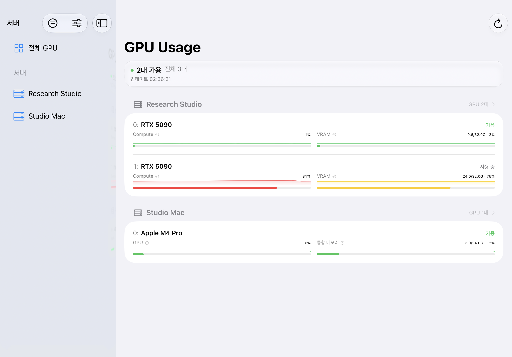
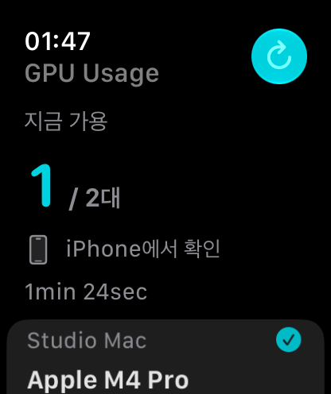

# GPU Usage

Your GPUs, everywhere. A small utility for researchers and developers, with native Mac, iPhone and iPad apps, an Apple Watch companion, a VS Code dashboard, and an agent-friendly CLI.

**Beta limitation:** Production iCloud setup is pending. Cross-device settings sync and iPhone-to-Mac Pro activation do not work yet. Manual server registration and viewing work independently on each device.

[Download the current beta](https://github.com/saankim/myapps-releases/releases/tag/gpu-usage-v2.1.1) · [Privacy](PRIVACY.md)

## Install

**Mac:** Requires an Apple silicon Mac running macOS 26 or later. Unzip the release and move **GPU Usage.app** to **Applications**. Open it and use the menu-bar CPU icon. The app is signed with Developer ID and notarized by Apple.

**iPhone / iPad:** Requires iOS or iPadOS 26 or later. The current version is an internal TestFlight beta; an invited Apple account is required. The public App Store listing is not yet available.

**Apple Watch:** Requires watchOS 26 or later and a paired iPhone with GPU Usage. Open the iPhone app first, then the Watch app. The Watch shows the latest iPhone readings and can request a refresh when the phone is reachable. It does not make SSH connections. Notification mirroring follows your iPhone and Watch notification settings. Companion transport and notification delivery still need confirmation on physical devices.

**VS Code:** Install the `.vsix` file from the release using Extensions → Install from VSIX. Requires VS Code 1.138 or later on macOS. Open the GPU Usage view and keep the Mac app running. The extension also works in a remote workspace because it reads the local Mac app's snapshots.

**CLI:** Download `gpu-usage`, then place it in a directory on your PATH:

```sh
mkdir -p "$HOME/.local/bin"
install -m 755 gpu-usage "$HOME/.local/bin/gpu-usage"
"$HOME/.local/bin/gpu-usage" --help
```

If `~/.local/bin` is not on your PATH, use the full path or add it to your shell's PATH. The launcher invokes the signed Mac app; keep the app in Applications. It does not replace any customized `gpu-usage.sh`.

## Connect

Register a server in Settings using an SSH address, username and key or password. Mac SSH `Host` entries appear automatically, including included configuration files; wildcard entries and proxy/jump connections are excluded. iPhone and iPad support unencrypted OpenSSH Ed25519 keys and SSH passwords. Confirm the server fingerprint against a trusted existing connection. Each device still needs a network route to the server.

Settings sync uses the same iCloud account and iCloud Keychain. There is no QR setup, required Mac setup step on iPhone, remote helper, or push relay. Current beta deployment limitations are listed in the release notes.

## Apple GPU and MPS

An Apple silicon Mac running the menu-bar app adds itself automatically. It reads the whole Apple GPU through local driver counters, without SSH or a privileged helper. Remote Apple silicon Macs can also be queried over direct SSH. To view your local Mac from iPhone/iPad, configure an SSH address and credentials for that Mac and enable Remote Login yourself if desired; the app never enables it for you.

GPU utilization includes Metal/MPS and other GPU users, including the desktop compositor. **Unified memory** means GPU driver allocation divided by the Mac's total physical memory. This is not dedicated VRAM or the memory used by one PyTorch model. The driver counter schema can change in a future macOS release; missing counters produce an error, never a fabricated zero.

On macOS the process picker lists the connected user's processes. It cannot identify which of them uses MPS. Search by name or PID and select the process you want to watch. No remote agent or training-code instrumentation is needed.

## Monitor

The dashboard uses the original compact rows, small usage bars and recent-history charts, with clear stale-data states. A GPU is available when both values are below your thresholds (default: compute 10%, VRAM 20%). Unreachable servers remain visible and can be disabled.

Use the server filter at the top of the dashboard (or in Settings) to choose which servers appear. The GPU count, Mac menu-bar summary and VS Code view follow that selection; the Watch follows the iPhone selection. Hidden servers continue to be queried and can still generate notifications. Select **Show all servers** to include newly discovered servers automatically. CLI host arguments remain independent of the display filter. Selection is saved locally; cross-device sync has the beta limitation above.

The awake Mac polls at your chosen interval while its menu-bar app runs. iPhone and iPad poll while visible; background refresh happens only when the operating system permits it. Apple Watch displays the latest phone snapshot and marks old results for rechecking. Background timing and notifications are not guaranteed. Job completion means the selected process disappeared, not that it succeeded.

Viewing and settings sync are free. Pro adds local GPU-available and process-completion notifications and the CLI, at USD **1.99/month** or **19.99/year**, with Apple-localized storefront pricing. TestFlight purchases use Apple's test environment. Public subscriptions require App Review before sale.

```sh
gpu-usage --json
gpu-usage --available=10,20 --json --watch=10
gpu-usage --tsv research-server
```

JSON watch mode emits one snapshot per line. Exit status: 0 success, 2 invalid input or connection failure, 3 Pro required. Credentials are never included in the output. JSON adds `backend: "appleMetal"` for Apple GPUs. For compatibility, the TSV columns still use `vram_*` names; for an Apple GPU these carry the unified-memory driver allocation described above, in GiB.

## Interface preview

These captures use sample servers and GPU data.




