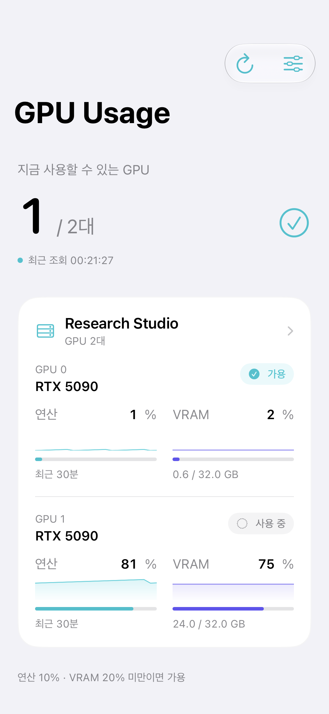
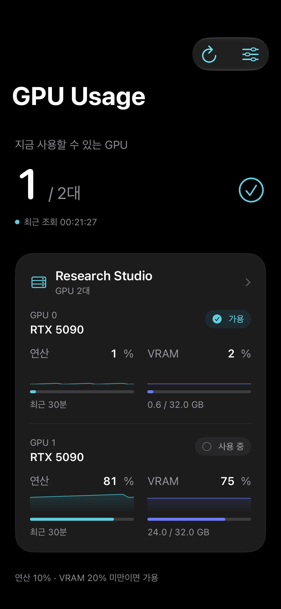

# GPU Usage

Your GPUs, everywhere. A small utility for researchers and developers, with native Mac and iPhone apps, a VS Code dashboard, and an agent-friendly CLI.

**Beta limitation:** Production iCloud setup is pending. Cross-device settings sync and iPhone-to-Mac Pro activation do not work yet. Manual server registration and viewing work independently on each device.

[Download the current beta](https://github.com/saankim/myapps-releases/releases/tag/gpu-usage-v2.0.0) · [Privacy](PRIVACY.md)

## Install

**Mac:** Requires an Apple silicon Mac running macOS 26 or later. Unzip the release and move **GPU Usage.app** to **Applications**. Open it and use the menu-bar CPU icon. The app is signed with Developer ID and notarized by Apple.

**iPhone:** Requires iOS 26 or later. The current version is an internal TestFlight beta; an invited Apple account is required. The public App Store listing is not yet available.

**VS Code:** Install the `.vsix` file from the release using Extensions → Install from VSIX. Requires VS Code 1.138 or later on macOS. Open the GPU Usage view and keep the Mac app running. The extension also works in a remote workspace because it reads the local Mac app's snapshots.

**CLI:** Download `gpu-usage`, then place it in a directory on your PATH:

```sh
mkdir -p "$HOME/.local/bin"
install -m 755 gpu-usage "$HOME/.local/bin/gpu-usage"
"$HOME/.local/bin/gpu-usage" --help
```

If `~/.local/bin` is not on your PATH, use the full path or add it to your shell's PATH. The launcher invokes the signed Mac app; keep the app in Applications. It does not replace any customized `gpu-usage.sh`.

## Connect

Register a server in Settings using an SSH address, username and key or password. Mac SSH `Host` entries appear automatically, including included configuration files; wildcard entries and proxy/jump connections are excluded. iPhone supports unencrypted OpenSSH Ed25519 keys and SSH passwords. Confirm the server fingerprint against a trusted existing connection. Each device still needs a network route to the server.

Settings sync uses the same iCloud account and iCloud Keychain. There is no QR setup, required Mac setup step on iPhone, remote helper, or push relay. Current beta deployment limitations are listed in the release notes.

## Monitor

The dashboard separates compute usage and VRAM, with recent history and clear stale-data states. A GPU is available when both values are below your thresholds (default: compute 10%, VRAM 20%). Unreachable servers remain visible and can be disabled.

The awake Mac polls at your chosen interval while its menu-bar app runs. iPhone polls while visible; background refresh happens only when iOS permits it. Background timing and notifications are not guaranteed. Job completion means the selected process disappeared, not that it succeeded.

Viewing and settings sync are free. Pro adds local GPU-available and process-completion notifications and the CLI, at USD **1.99/month** or **19.99/year**, with Apple-localized storefront pricing. TestFlight purchases use Apple's test environment. Public subscriptions require App Review before sale.

```sh
gpu-usage --json
gpu-usage --available=10,20 --json --watch=10
gpu-usage --tsv research-server
```

JSON watch mode emits one snapshot per line. Exit status: 0 success, 2 invalid input or connection failure, 3 Pro required. Credentials are never included in the output.

## Interface preview

These captures use sample servers and GPU data.



